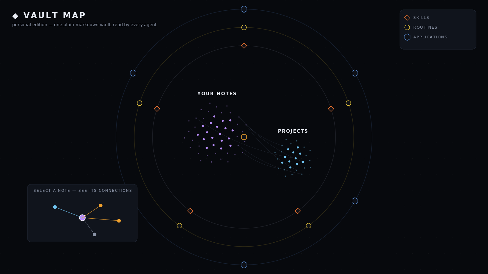
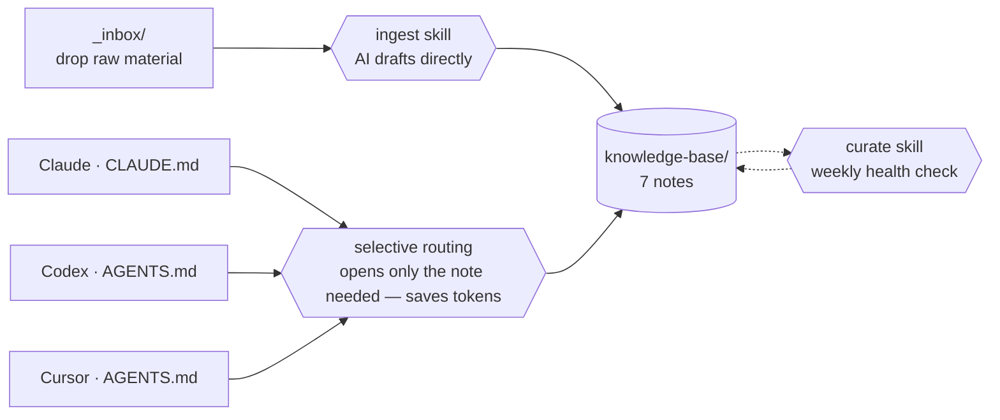

# Portable Cross-Agent Second Brain — Personal

A plain-markdown second brain for **one person**, working the same in **Claude,
Codex, and Cursor** through two instruction files. It routes to the note it needs
instead of loading everything, so it **saves tokens** — and because you're the
only user, there's no approval queue: the AI drafts straight into your notes and
you edit or prune in place.

No database. No vectors. No Obsidian. No lock-in. Clone it, fill in seven notes,
point any of three agents at it, and your AI stops forgetting who you are between
sessions.



*The bundled `vault-map.html` renders your vault like this — open it straight
from the folder, no server, no build step. Click any note to spotlight what
links to it and what it links to.*

> **Working with a team?** The [Team edition](https://github.com/policani/portable-cross-agent-second-brain)
> is the same core with a propose-then-approve gate, so shared memory stays
> trustworthy when more than one person (and their agents) write to it.

## Management Console

Open **`Open-Second-Brain-Console.bat`** to launch the browser console with a
local-only helper. Its **Refresh** button rebuilds `brain-index.js` and reloads
the same page, with a timestamp down to the second. The constellation's search
and display controls can be tucked away with the × button and restored with ☰.

`vault-map.html` still opens directly from the folder for a standalone map. For
the live refresh workflow, keep the minimized local server window open while you
use the console. Nothing is uploaded and no account is required.

## How it works



New material is captured in `_inbox/`, the ingest skill turns it into notes
**directly** in `knowledge-base/`, and you edit or delete in place — no approval
step, because you're the only user. On the read side, each of the three agents
**routes to the one note it needs** instead of loading the whole vault — that's
the token-saving retrieval layer. The same vault is read by all three agents
through two files kept in parity: Claude reads `CLAUDE.md`; Codex and Cursor both
read `AGENTS.md` (Cursor reads it natively).

The routing is enforced by code, not just convention. The bundled **`brain.py`**
(one file, Python stdlib, zero dependencies) indexes every heading-level section
of the vault and answers "where is X?" deterministically — keyword scoring,
`path:line` targets, best section printed straight to the terminal — before a
single model token is spent. The same generated index feeds the **Management
Console** (`index.html`) and **`vault-map.html`**, an interactive map of the
vault (departments, files, skills, connected apps and routines) that opens
directly from the filesystem.

## Why it's valuable

The done-for-you, team-grade version of this is the kind of build that sells for
around **$5,000**. This personal edition is the same core — free, MIT-licensed,
and readable in ten minutes.

The payoff is the token economy. Because the AI reads one shared context and
routes to only the note it needs, you stop re-pasting the same background into
every session and the model stops re-reading context it doesn't need. Fewer and
smaller context loads means a smaller bill every session — and it compounds the
more you use it.

## Status

Working starter kit. Copy the folder, fill the vault, point your agent at it. The
structure and rules are stable; the seven notes ship as templates with one small
fictional example.

## Why this exists

Most "AI second brain" setups are either too complicated (vector stores,
plugins, a tool to learn) or locked to one vendor. This is the opposite:

- **Uncomplicated.** Seven markdown files and two instruction files. You can read
  the whole thing in ten minutes. The knowledge is yours, in a format any AI can
  read, forever.
- **Interchangeable across agents.** Claude reads `CLAUDE.md`; Codex and Cursor
  read `AGENTS.md` (Cursor reads it natively as of 2026). Two files in parity =
  one vault that behaves consistently in all three. Switch tools, or use all
  three on the same brain, with zero migration.
- **Token-efficient by design.** Selective routing means the agent reads a small
  map and opens only the relevant note — retrieval without a vector database.
  It's what keeps the no-database approach cheap as the vault grows.
- **Frictionless for solo use.** No approval queue. The AI drafts straight into
  your notes; you edit or prune in place. The protection isn't a gate — it's
  traceability: every fact records its source and a status (extracted / inferred
  / verified / deprecated), so a guess is never mistaken for a fact.

## What's inside

```
CLAUDE.md / AGENTS.md   two instruction files, kept in parity (the parity is the product)
knowledge-base/         the 7 notes: snapshot, key-people, preferences-and-rules,
                        project-history, decisions-and-rationale, open-loops, source-links
_inbox/                 drop raw material here; ingest turns it into notes directly
skills/ingest/          capture new material straight into the vault
skills/curate/          weekly health check
brain.py                deterministic retrieval: index + query, no dependencies
index.html              Management Console — Constellation, Types, Sizes, Table
vault-map.html          interactive vault map, opens from the filesystem
serve-second-brain.py   localhost-only helper for live console refreshes
Open-Second-Brain-Console.bat  one-click launcher for the live console
INSTALL.md              setup for Claude, Codex, and Cursor
```

## The 7 notes

A working memory is seven kinds of note — that's the whole schema:

1. **Snapshot** — who you are, one paragraph
2. **Key people** — stakeholders, roles, who decides
3. **Preferences & rules** — how you like things done, and the red lines
4. **Project history** — what happened, in order
5. **Decisions & rationale** — what was decided and why
6. **Open loops** — commitments still in the air
7. **Source links** — where each fact came from

Each note carries frontmatter with a `status` (extracted / inferred / verified /
deprecated) and `sensitivity` (public / internal / confidential / restricted), so
a guess is never mistaken for a fact.

## How the routing works (the token-saver)

The instruction files carry a small routing map — "for this kind of question,
open this note" — and the rule *don't load the whole vault by default*. The agent
reads the map, opens only what's relevant, and skips the rest. With seven notes
the map is tiny; the point is that it keeps working as the vault grows to seventy.
That's retrieval-by-routing instead of retrieval-by-embedding: no vector store,
no index server, just a table and a discipline — and a smaller context bill every
session.

## How to evaluate this in 5 minutes

1. Read `CLAUDE.md` and `AGENTS.md` side by side — note they're the same rules,
   phrased per client, including the routing map. That's the portability and the
   token-saving, made concrete.
2. Skim `knowledge-base/snapshot.md` to see the note shape and the example.
3. Read `skills/ingest/SKILL.md` to see how capture writes straight into the vault.
4. Then the real test: open the folder in Claude (or Codex, or Cursor), fill the
   snapshot, and ask for one real task using only the vault. Run the same ask in
   a blank chat with no vault. The difference is the point.

## Quick start

See `INSTALL.md`. Short version: fill `knowledge-base/`, point your agent at the
folder, run **ingest** when new material shows up, run **curate** weekly.

## Scope boundaries

This is a starter kit, deliberately small. It does **not** include: a hosted
server or database, automated connectors (you wire those per environment), or
migration of historical documents. Those are the natural next step up, not the
first delivery.

---

Built by [Marco Policani](https://policani.net). MIT licensed — plain markdown,
no dependencies, yours to run and adapt.
